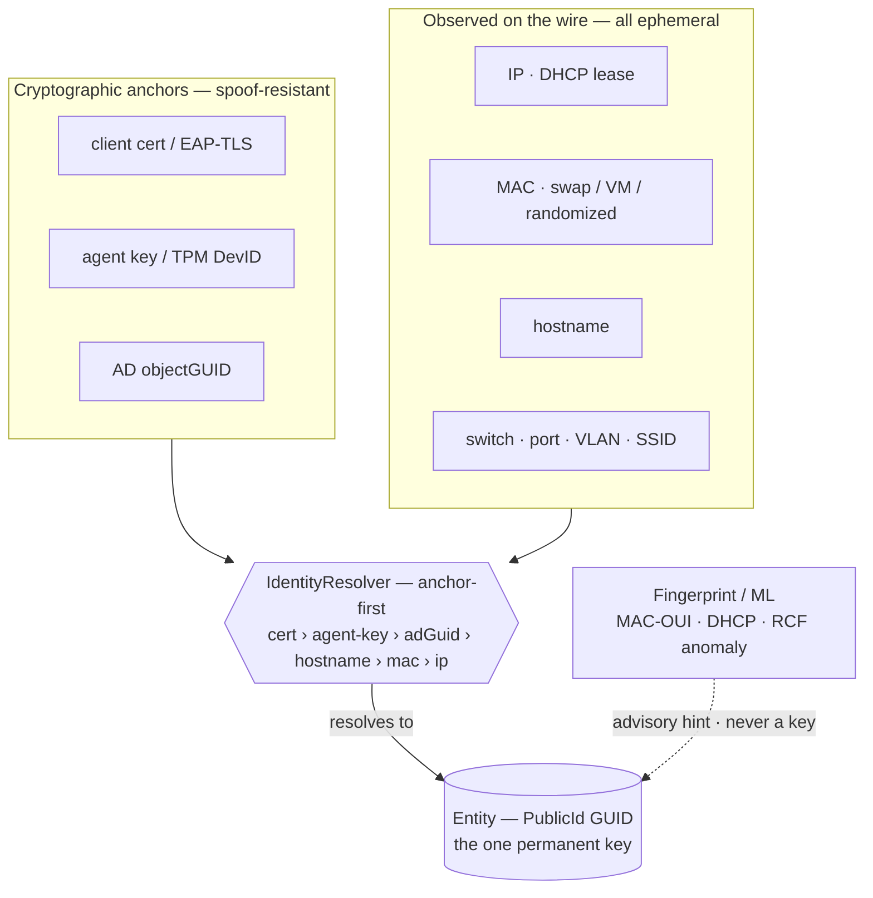

Everything a device presents to a network is **ephemeral**. Its IP comes from DHCP. Its MAC changes when you swap a NIC, plug in a USB-C dongle, clone a VM, or when the OS rotates a private MAC per Wi-Fi network. Its hostname, its SSID, its VLAN, its switch port — all of it can change while it's still the *same device*. Any monitoring tool that keys a device on one of those attributes will, sooner or later, split one device into two or merge two into one.

Skans is built on the opposite assumption: **no network-presented attribute is ever a permanent key.** Each is a *time-bound observation*. The one permanent key is an opaque entity id Skans owns.

::: note
This is the correlation model — how Skans decides *"this thing on the network is the same device I already know."* It's distinct from **[Device identity & the CA](/2.0/concepts/device-identity/)**, which is about the X.509 certificate a device is *issued*. The certificate is, in fact, the strongest input to this model.
:::

## The one permanent key

Every device is an **entity** with a stable, opaque `PublicId` (a GUID) that Skans mints and never reuses. IP, MAC, hostname, VLAN, and port are **attributes observed over time**, each recorded with its source and a confidence — never a key, a join, a uniqueness constraint, or a document id.

Current state is *projected* from that observation log. "Which device is at 10.0.0.5 right now?" is answered by reading the most recent, still-valid observation — not by trusting that an address belongs to a device forever.

## Resolution is anchor-first

When Skans sees a device, it resolves it to its entity through **one path**, strongest signal first. A spoofable IP can never override a cryptographic anchor.

The order is the whole point: a **certificate** (or the agent's key, or a TPM DevID) is spoof-resistant, so it wins. `objectGUID`, hostname, MAC and IP follow in descending trustworthiness. If a device presents its cert *and* an IP that currently belongs to someone else, it resolves to **itself** — an attacker can't impersonate a device by grabbing its address.

## One resolution path, no fallbacks

There is a single resolver over a single observation log. There is **no second, column-based lookup to "fall back" to** — a fallback is a smell, because it means the primary path isn't trusted. Every place that learns a device identifier (an enrollment, a discovery, a DHCP lease, a controller sighting) **seeds the same log**, so the log is authoritative. Resolution either finds the entity or honestly returns *unknown*.

## Identity survives change — the cryptographic anchor

Because identity is anchored on cryptography, the entity is stable across the churn that breaks attribute-keyed systems:

| The device… | …stays one entity because |
| --- | --- |
| moves Wi-Fi → wired, or you swap its NIC / USB dongle | both MACs are observations of the same entity |
| is a VM whose MAC you changed in Proxmox | the hostname / cert anchor is unchanged |
| gets a new IP from DHCP | IP was never the key |
| **renews or rotates its certificate** | the prior anchor is retired and the new one recorded as *lineage* — one entity, not two (IEEE 802.1AR IDevID/LDevID continuity) |
| is re-imaged but rejoins the same AD object | the `objectGUID` anchor holds |

## Fingerprinting is advisory — never an identity

For **unmanaged** devices with no certificate or agent, Skans fingerprints them — MAC-OUI → vendor, DHCP option-55 → OS, open ports/services → type, and an in-cluster **Random Cut Forest** model flagging devices that behave unlike their peers. All of it is deterministic and air-gap-safe.

::: warning
Fingerprint and ML output is **strictly advisory** — a hint attached to an entity that was already resolved by durable means. It **never** creates or resolves an identity. Fingerprint churn silently splitting one device into two (or merging two into one) is exactly the failure mode this architecture exists to avoid.
:::

## The honest bound

A device that **never authenticates** and **rotates its MAC every connection**, presenting no other stable signal, genuinely *cannot* be given a persistent identity — no system can, and Skans doesn't pretend to. It's flagged as a randomized/transient identity rather than force-fit to the wrong device.

## Where it lives

- **SQL** holds only a thin authoritative spine: the identifier→entity bindings, the cryptographic anchors, the NIC set, and the merge/split lineage.
- **OpenSearch** is the observation, correlation, and ML fabric — the telemetry and events already flowing in, from which current state is projected.

::: note
The full decision record and phased build-out are in the architecture doc as **AD-94**. This model is proven by a property-test suite covering the adversarial-churn scenarios above — Wi-Fi↔wired, USB-dongle / VM MAC change, IP reassignment, cert renewal, spoof-resistance, and randomized-MAC non-merge.
:::

## Next

- **[Device identity & the CA →](/2.0/concepts/device-identity/)** — the certificate that is the strongest anchor above
- **[Network access control →](/2.0/how-tos/network-access-control/)** — cert-gated 802.1X, where identity meets admission
- **[The driver pack →](/2.0/concepts/driver-pack/)** — how vendor-specific code stays out of the core
