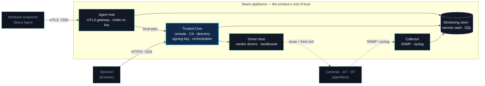

Skans is a single self-contained appliance that delivers and manages the entire security posture of an **isolated network** — the camera, IoT, OT, and building-automation enclaves that can't (or shouldn't) reach the cloud or a corporate directory. In one box it provides the enclave's **root of trust**, its **core network services**, and its **compliance evidence**.

It's built to be run by the technician who installs the equipment — not a security team. You answer two or three plain questions and press one button; everything underneath (directory, certificate authority, network access control, monitoring) is handled for you.

::: note
This page is the mental model. If you just want to get a box running, jump to the **[Quickstart](/2.0/getting-started/quickstart/)**. If you're an admin who wants the deeper architecture, each concept below links out to detail.
:::

## Architecture at a glance

*Operators reach one console; endpoints and devices are onboarded through the two lanes below. The riskier surfaces — the agent hub and the vendor driver host — are isolated and hold no CA key; only the trusted core signs.*

## The core idea: an enclave gets a root of trust

Most isolated networks have the same problem: the cameras, intercoms, and controllers on them **can't domain-join or enroll themselves**, there's often no real directory or IT team on site, and yet the network still has to meet requirements like NIST 800-171. Devices ship with self-signed certs and default passwords, and nobody owns the identity of anything.

Skans fixes that by **becoming the authority** the enclave never had:

- It stands up a **directory** and a **certificate authority** on the appliance itself.
- It gives **every device its own identity** — a real X.509 certificate issued by that CA.
- It adds the controls that identity makes possible: access control, patching, hardening, backup, monitoring — and audit-ready evidence that it's all happening.

Nothing leaves the wire. When a feature needs outside data (a patch, a threat feed, a new driver), it arrives as a **signed bundle** that the appliance verifies before use — never by opening the enclave to the internet.

## Two lanes: how devices get an identity

Devices fall into one of two onboarding lanes, and Skans picks the right one automatically based on what the device actually is.

**Lane A — agentless (cameras, IoT, OT).** Skans reaches *into* the device using a vendor-specific driver, issues it a certificate from the built-in CA, pushes and binds that cert onto the device, and then **verifies the device is actually serving it** (not "should work" — proven on the wire). Monitoring is agentless: SNMP, syslog, and probes from outside. The device runs nothing of ours.

**Lane B — agent-managed (Windows servers and workstations).** Skans deploys a lightweight **agent** that runs *on* the endpoint and handles patching, inventory, Defender health, compliance checks, logs, and metrics — reporting back over mutual TLS. See **[Install & approve the Windows agent](/2.0/how-tos/install-the-agent/)**.

::: tip
Classification is **OS-based, not port-based**. Skans reads what a device actually is (from the directory, with a DNS fallback), so a Windows Server that only has Remote Desktop open is correctly treated as a server on the agent lane — not mis-typed as a workstation. Windows endpoints always go through the agent; SNMP is only ever used for IoT/OT gear.
:::

## The driver pack: vendor support without vendor risk

The knowledge of how to talk to each vendor's device lives in the **Skans Driver Pack** — a separately versioned, cryptographically signed artifact, on the same model as a Milestone device pack. Adding or fixing a vendor means shipping a **new pack**, not rebuilding the appliance.

- **122 vendor drivers** ship today, spanning cameras and physical security, network gear, firewalls, servers/BMC, building automation, industrial PLCs, access control, and more.
- **8 are validated against real hardware** end-to-end (Axis, 2N, Bosch, Uniview/FS, Hanwha, ONVIF, Redfish, UniFi). The rest are authored from each vendor's official management API and adversarially verified, with hardware validation pending.
- When a device genuinely has no certificate API, the driver **says so with a clear error rather than faking success** — you secure the conduit (the switch or firewall in front of it) and monitor the device instead.

Critically, the vendor code runs **out-of-process**, in an isolated host that holds no CA key and no secrets. The certificate authority's private key never leaves the trusted core. That keeps third-party driver code — a supply-chain and credential surface — away from the crown jewels.

::: warning
The pack is signed with a **separate, off-appliance release key**, deliberately *not* your site's CA. A pack that is missing, tampered with, unsigned, or ABI-incompatible is refused. A bad pack fails safe: the appliance keeps running, and enrollment fails closed per-device rather than issuing a bad identity.
:::

## The run model: always-on services

Skans runs as a set of **always-on, supervised services** (they start at boot and restart on failure), not scheduled scripts. You interact with one console; underneath, separate least-privileged services handle the control plane, agent telemetry, agentless collection, and the driver-host sandbox, while periodic jobs (backups, feed syncs, drift checks) run in-process on internal timers. The trusted core is one hardened process; the riskier surfaces (agent hub, driver host) are isolated. Platform pieces degrade gracefully — the console keeps working even if the monitoring store is down.

## One box, or many

The flagship deployment is the **single self-contained appliance** — every service on one box — sized for an isolated single-site enclave.

For large or multi-site enclaves, Skans has a **Core + Edge** design: a central Core (the system of record, CA, and console) plus one or more lightweight **Edge** relays per site that collect and forward, holding no CA key. This distributed tier is largely a design-stage capability today; the single appliance is what ships and is proven live.

::: note
Skans comes in two engine flavors that look identical to you: a **Windows Server** appliance (the primary SKU, using native AD/AD CS/NPS roles) and an **open-source Linux** SKU (step-ca, Samba, FreeRADIUS) for sites that want no Windows license. Same console, same drivers, same workflow — see **[Requirements](/2.0/getting-started/requirements/)**.
:::

## What you actually get

Once an enclave is set up, Skans provides, on one box:

- **Identity** — a CA that issues and manages a certificate for every device
- **Access control** — 802.1X (EAP-TLS) network admission, RBAC, optional smart-card MFA
- **Patching & firmware** — scheduled updates with per-host pass/fail
- **Backup** — configuration and off-box backups (getting data *off* the source)
- **Monitoring** — correlated, deduplicated findings per device (never a raw event firehose)
- **Vulnerability management** — CVE + MITRE ATT&CK matched against your live inventory
- **Compliance evidence** — a one-command **[NIST/CMMC evidence pack](/2.0/compliance/nist-cmmc-evidence/)** built from live state

## Next

- **[Requirements →](/2.0/getting-started/requirements/)** — what a site needs before you install
- **[Quickstart →](/2.0/getting-started/quickstart/)** — a working, secured site in about 15 minutes
