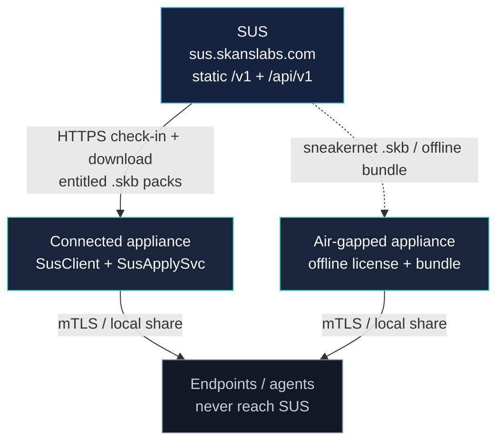

The **Skans Update Service (SUS)** is Skans' single, licensed upstream for **product content** and **security datasets**. Instead of the appliance (or every endpoint) egressing to many third-party CDNs, a connected site can allowlist **one hostname** — `sus.skanslabs.com` — and pull content that Skans has packaged, signed, and entitlement-gated.

Endpoints **never** talk to SUS. Agents and devices pull only from **this appliance**. SUS is **download-only**: it does not receive your identities, keys, inventory, or audit data.

::: note
SUS is **opt-in**. Periodic connected check-in defaults to **off** (`sus.enabled`). Air-gapped sites leave it off and import signed offline packages instead.
:::

## Why SUS exists

| Need | What SUS provides |
| --- | --- |
| One firewall story | Allowlist `sus.skanslabs.com` (HTTPS) instead of many vendor CDNs |
| Trust | Content arrives as signed `.skb` packs; the appliance verifies against the held **pack trust anchor** before apply |
| Licensing | Connected check-in presents a license key (or Community defaults); SUS returns only **entitled** catalog items |
| Curation | Security feeds and product packs are Skans-packaged; change-detect daily where applicable |

Related: [Vulnerability management](/2.0/monitoring/vulnerability-management/) (how feeds are *used* on-box), [Patching & firmware](/2.0/how-tos/patching/) (Windows/Microsoft path — **not** the same as SUS), [The driver pack](/2.0/concepts/driver-pack/).

## Two paths, one signed content model



| Path | Who uses it | How content arrives |
| --- | --- | --- |
| **Connected** | Appliance has outbound HTTPS to SUS | `SusClient` check-in → catalog → download → `SyncBundleSvc` verify + apply (`--sus-apply` or periodic job when enabled) |
| **Air-gap** | No internet on the appliance | Operator imports a signed offline license (if used) and/or signed `.skb` / offline bundle; same verify + apply pipeline |

Both paths end in the same place: **CMS-verified packs** applied by the control plane. A tampered or unsigned pack is refused.

## What content SUS carries

**Policy:** Skans **product** content and **cybersecurity datasets** only. SUS does **not** redistributing third-party OS patch mirrors or vendor **firmware binaries**.

| Class (channel) | Kind | What it becomes on the appliance |
| --- | --- | --- |
| `driver-pack` | `driverpack` | Versioned driver store + hot-reload (`C:\Skans\drivers\…`) |
| `feed-kev` | `threat-feed` | OpenSearch `skans-kev` (CISA Known Exploited) |
| `feed-cve` | `threat-feed` | OpenSearch `skans-cve` (CVE corpus) |
| `feed-attack` | `threat-feed` | OpenSearch `skans-attack` (MITRE ATT&CK Enterprise) |
| `feed-attack-ics` | `threat-feed` | OT/ICS ATT&CK content (ingest with other threat feeds) |
| `feed-epss` | `threat-feed` | OpenSearch `skans-epss` (FIRST.org EPSS scores) |
| `feed-sigma` | `threat-feed` | OpenSearch `skans-sigma` (detection rules) |
| `clamav-defs` | `clamav-defs` | Live defs mirror `C:\Skans\share\clamav\` + `current.json` |
| `product` | `product` | Staged under `C:\Skans\updates\product\{version}\` + `current.json` |
| `agent` | `agent` | Staged under `C:\Skans\updates\agent\{version}\` + `current.json` |

Security feeds are refreshed upstream on a **daily change-detect** schedule. Driver packs and product/agent packs publish **on release**.

::: tip
**Product and agent channel packs** prove the signed delivery path today; **GA release artifacts** replace stubs as Skans ships installers. Apply still lands versioned directories and `current.json` pointers either way — installing/swapping a running agent or product build is a separate operator/agent step that consumes those pointers.
:::

### Explicitly out of scope on SUS

- Microsoft Update / WSUS **payload mirrors** (Windows patching uses the appliance WUA path — see [Patching](/2.0/how-tos/patching/))
- Bulk vendor **camera/switch firmware images** as SUS-hosted content
- Commercial threat-intel resale without a Skans license arrangement

## Editions and entitlements

Connected check-in returns an **edition** and a list of **entitlements**. Community baseline content (product, agent, driver pack, threat feeds, ClamAV defs) is available without a paid key; unknown or empty license keys check in as **Community**. Paid editions may unlock additional kinds over time (for example deeper OT packs or offline-bundle workflows).

| Setting | Meaning |
| --- | --- |
| License key (when issued) | Presented as `X-Skans-License` on check-in; maps to edition + entitlements in SUS |
| No / unknown key | Community catalog for baseline kinds |

Portal and license issuance for customers are at **[portal.skanslabs.com](https://portal.skanslabs.com/)** (operator-facing product front door). This page is about the **appliance** consuming SUS.

## Connected path — operator steps

### 1. Network

- Appliance can resolve and reach **`https://sus.skanslabs.com`** (TCP 443).
- Prefer **public DNS** that returns Cloudflare edge addresses for that name. If internal DNS points at a private origin IP, TLS may fail validation (Origin certificate vs public edge certificate). Fix DNS, or follow your lab guidance for trust of the path you actually use.
- No proxy is required by default; if you force HTTPS inspection, ensure the appliance trusts the intercepting CA (generally avoid intercepting SUS).

### 2. Settings (on the appliance)

Settings live in the on-box store (`C:\Skans\config\settings.json` via the console / settings APIs). Relevant keys:

| Key | Default | Purpose |
| --- | --- | --- |
| `sus.enabled` | `false` | When **true**, the periodic in-process job may check in / apply. Manual CLI still works when false. |
| `sus.baseUrl` | `https://sus.skanslabs.com` | Override only for a lab stub or approved relay |
| `sus.channel` | `stable` | Content channel (`stable` or `beta` when offered) |
| `sus.licenseKey` | *(empty)* | Connected license string when you have one |

A stable **appliance id** is minted once and stored (for example under `C:\Skans\sus-appliance-id`) so SUS can correlate check-ins. It is not a secret; the license key is the credential.

### 3. Probe: `--sus-check`

From an elevated shell on the appliance (or via your remote management path), run the control plane CLI:

```text
C:\Skans\controlplane\Skans.ControlPlane.exe --sus-check
```

You should see:

- SUS base URL and appliance id  
- **ping** — service name / version if reachable  
- **checkin** — edition, entitlements, and catalog item count when successful  

If ping fails, fix DNS/TLS/egress before applying.

### 4. Apply: `--sus-apply`

```text
C:\Skans\controlplane\Skans.ControlPlane.exe --sus-apply
```

This:

1. Checks in and loads the entitled catalog  
2. Skips kinds already at the offered version (for example driver pack already current)  
3. Downloads each new pack, verifies signature + hashes against the **pack anchor**  
4. Applies through the same import pipeline as offline packs  

Example successful summary line:

```text
sus-apply:  N applied, M skipped, 0 failed
```

Pack anchor locations the apply path resolves include:

- `C:\Skans\driverhost\pack-anchor.pem`  
- `C:\Skans\secrets\pack-anchor.pem`  

If no anchor is present, apply aborts — trust cannot be established.

### 5. What “applied” looks like

| Kind | Where to look |
| --- | --- |
| Driver pack | `C:\Skans\drivers\current.json` and versioned pack directory |
| ClamAV defs | `C:\Skans\share\clamav\` (`main.cvd`, `daily.cvd`, `bytecode.cvd`, `current.json`) |
| Product / agent | `C:\Skans\updates\product\current.json`, `C:\Skans\updates\agent\current.json` |
| Threat feeds | On-box OpenSearch indices such as `skans-cve`, `skans-kev`, `skans-attack`, `skans-epss`, `skans-sigma` (via console vulnerability / search surfaces) |

Threat-feed apply hands files to **VulnFeed** (`--ingest-file`) so indices stay local to the appliance.

## Air-gap path

1. Leave **`sus.enabled` false** (default).  
2. Obtain Skans-issued **offline license** material and/or **signed packs / offline bundle** through your Skans channel (not built by the public website).  
3. Import with the control plane offline verbs (for example `--sus-import-license`, `--sus-import-bundle` / pack import — see release notes for the exact flags on your build).  
4. Apply still runs through **signature verification** then the same landings as connected apply.

::: note
**Offline sneakernet packaging and offline licensing workflows** are oriented to higher-touch / Enterprise-style deployments. Connected Community sites use online check-in for baseline security and product channel content.
:::

## Trust and security properties

- **Download-only** — SUS does not receive enclave data.  
- **Signed packs** — apply refuses bad signatures / hash mismatches.  
- **Entitlement gate** — connected API streams only entitled content ids.  
- **Endpoints isolated** — agents use mTLS to the appliance only ([ports](/2.0/reference/ports/)).  

## Troubleshooting

| Symptom | What to check |
| --- | --- |
| `ping: UNREACHABLE` / SSL errors | DNS for `sus.skanslabs.com`, outbound 443, TLS interception, clock skew |
| `check-in failed` HTTP error | License key value, SUS service status, proxy auth |
| `pack trust anchor not found` | Pack anchor PEM present under `C:\Skans\driverhost\` or `C:\Skans\secrets\` |
| Apply reports failures mid-catalog | Disk space for large feeds (CVE packs can be hundreds of MB); re-run `--sus-apply` (already-current items skip) |
| Feeds applied but console empty | OpenSearch service running; VulnFeed path installed; see [Vulnerability management](/2.0/monitoring/vulnerability-management/) |
| Product/agent “stub” versions | Channel path is live; replace with GA artifacts when Skans publishes them |

## Related

- [Vulnerability management](/2.0/monitoring/vulnerability-management/) — how CVE / KEV / EPSS / ATT&CK findings are produced on-box  
- [Patching & firmware](/2.0/how-tos/patching/) — Windows Update rings (separate from SUS content)  
- [The driver pack](/2.0/concepts/driver-pack/) — what a driver-pack apply reloads  
- [How Skans works](/2.0/getting-started/how-skans-works/) — appliance mental model  
- Public SUS origin: [https://sus.skanslabs.com](https://sus.skanslabs.com) (API/ping for operators who monitor reachability)
